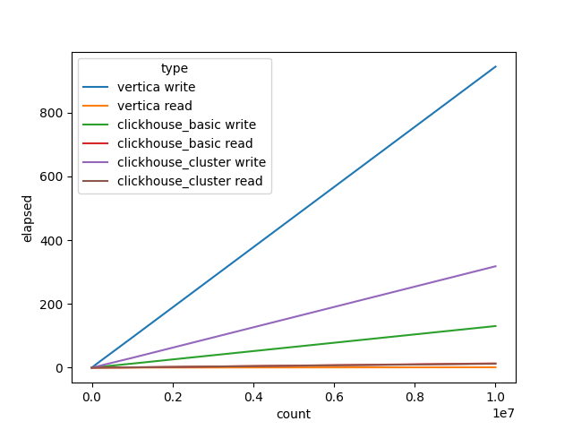

# Исследования хранилищ

В исследовании использовались:

- Clickhouse single node
- Clickhouse 4 node(как в теории курса)
- Vertica

Замеры проводились для чтения и записи поочерёдно, от 1000 до 10000000 записей.

## Результаты в сек.

|    |      count |   vertica write |   vertica read |   clickhouse_basic write |   clickhouse_basic read |   clickhouse_cluster write |   clickhouse_cluster read |
|---:|-----------:|----------------:|---------------:|-------------------------:|------------------------:|---------------------------:|--------------------------:|
|  0 |     1000   |       0.0998302 |     0.00670958 |                0.0147295 |              0.00367951 |                  0.0319979 |                0.00700498 |
|  1 |    10000   |       0.895903  |     0.0132158  |                0.137642  |              0.0120502  |                  0.2958    |                0.0173287  |
|  2 |   100000   |       9.9354    |     0.0365777  |                1.32442   |              0.0740364  |                  2.97252   |                0.125345   |
|  3 |  1000000   |      94.4462    |     0.309041   |               12.6504    |              0.769765   |                 30.6935    |                1.02851    |
|  4 | 10000000   |     944.614     |     1.14264    |              130.544     |             13.2925     |                318.148     |               12.2229     |

